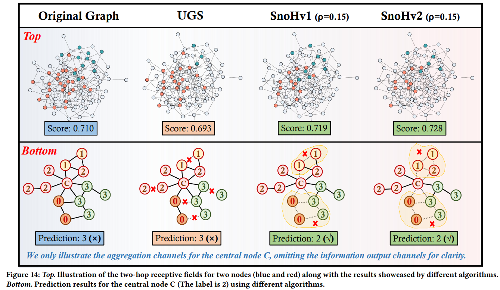
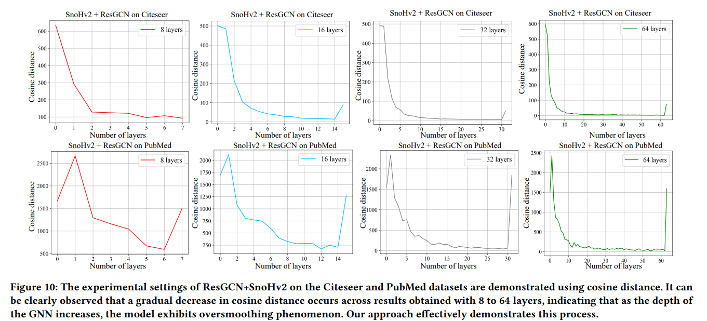
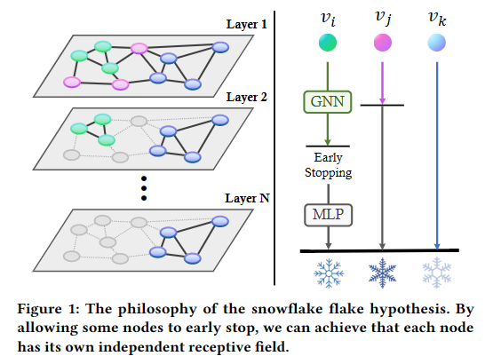

# SnoHv2
For cora,citeseer,pubmed datasets, we trained in a fully supervised form
For ogbn-arxiv, we use the official split
## Default 
    --dataset cora
    --dspath ./data
    --seed 42
    --device 0
    --epochs 500
    --lr 0.01
    --weight_decay  5e-4
    --block gcn
    --numlayer 32
    --hidden_channels 64
    --withbn False
    --stop_rate 0.1
## Usage
### gcn 16layer(without batch norm)
	python main.py --dataset cora/citeseer/pubmed --epochs 500 --lr 0.001 --block gcn --numlayer 16 --stop_rate 0.01
### gcn 32layer(+batch norm)
    python main.py --dataset cora/citeseer/pubmed --epochs 500 --lr 0.01 --block gcn --numlayer 32 --stop_rate 0.2 --withbn
    python main.py --dataset ogbn-arxiv --epochs 500 --lr 0.01 --block gcn --numlayer 32 --stop_rate 0.05 --withbn
    
### gcn 64layer(+batch norm)
    python main.py --dataset cora/citeseer/pubmed --epochs 1000 --lr 0.01 --block gcn --numlayer 64 --stop_rate 0.01 --withbn
    python main.py --dataset ogbn-arxiv --epochs 1000 --lr 0.01 --block gcn --numlayer 64 --stop_rate 0.01 --withbn

### resgcn 32layer
    cora/citeseer:
        python main.py --dataset cora/citeseer --epochs 500 --lr 0.01 --block resgcn --numlayer 32 --stop_rate 0.1 --withbn
    pubmed:
        python main.py --dataset pubmed --epochs 500 --lr 0.01 --block resgcn --numlayer 32 --stop_rate 0.15 --withbn
    ogbn-arxiv: 
        python main.py --dataset ogbn-arxiv --epochs 500 --lr 0.01 --block resgcn --numlayer 32 --stop_rate 0.1 --withbn
### resgcn 64layer
    python main.py --dataset cora/citeseer/pubmed --epochs 1000 --lr 0.01 --block resgcn --numlayer 64 --stop_rate 0.1 --withbn
    python main.py --dataset ogbn-arxiv --epochs 1000 --lr 0.01 --block resgcn --numlayer 32 --stop_rate 0.02 --withbn

### resgcn+ 32layer
    cora/citeseer:
        python main.py --dataset cora/citeseer --epochs 500 --lr 0.01 --block resgcn+ --numlayer 32 --stop_rate 0.4 --withbn
    pubmed:
        python main.py --dataset pubmed --epochs 500 --lr 0.01 --block resgcn+ --numlayer 32 --stop_rate 0.5 --withbn
    ogbn-arxiv:
        python main.py --dataset ogbn-arxiv --epochs 500 --lr 0.01 --block resgcn+ --numlayer 32 --stop_rate 0.05 --withbn
### resgcn+ 64layer
    python main.py --dataset cora/citeseer/pubmed --epochs 1000 --lr 0.01 --block resgcn+ --numlayer 64 --stop_rate 0.7 --withbn
    python main.py --dataset ogbn-arxiv --epochs 500 --lr 0.01 --block resgcn+ --numlayer 64 --stop_rate 0.02 --withbn

### Response to reviewer 65Ak

> **W1**: It is suggested to show the running time of applying SnoHv 1&2 and compare it with baseline model.

To better showcase the results, we conducted tests on the medium dataset, Arxiv, using a 32-layer GNN backbone (hidden layer=64, epoch=500, V100 support). The results are as follows. And we will try our best to add more results to the revised manuscript in the future.

**Table 1.** Running time of different baseline using SnoHv2 on ogbn-arxiv. For each backbone we trained 500 epochs
| baseline (8-layer)| original  | +SnoHv2  |
|----------|-----------|----------|
| GCN      | 404.67s   | 261.44s  |
| ResGCN   | 415.49s   | 223.53s  |
| ResGCN+  | 415.41s   | 339.49s  |

We demonstrate the training time of the model after pruning. We emphasize that SnoHv1/v2 functions as an **inference accelerator**, simultaneously offering interpretability to the pruning process, rather than focusing solely on the training process. This aligns with mainstream pruning literatures, which focus on the aspects of storage and inference [1-5]. Aggregation operations through adjacency matrices are a time-consuming part of graph neural networks. Therefore, the running time of our method (whether it is inference time or training time) depends on the sparsity of the adjacency matrix after pruning. The sparser the adjacency matrix, the shorter the time spent, while the original adjacency matrix is the densest. After adding SnoHv2, the baseline FLOPS will also decrease a bit, because the number of edges will decrease and the corresponding calculation will decrease.

[1] A unified lottery ticket hypothesis for graph neural networks

[2] Searching lottery tickets in graph neural networks: A dual perspective
 
[3] Brave the wind and the waves: Discovering robust and generalizable graph lottery tickets

[4] A study on the ramanujan graph property of winning lottery tickets

[5] Comprehensive graph gradual pruning for sparse training in graph neural networks

> **W2**: Emphasize the innovation of clearly adopting the snowflake hypothesis.

There has been considerable research on deepening GNNs, with deeper GNNs exhibiting greater fitting capabilities on large graphs, particularly in expansive social networks. These networks can aggregate more distant nodes for node updates. Additionally, deep GNNs pave a feasible path for the parallelism between GNNs and CNNs, serving as the foundation of our study. We have placed the relevant references at [6-15]. 

[6] Deepgcns: Can gcns go as deep as cnns?

[7] Training graph neural networks with 1000 layers

[8] Deepergcn: All you need to train deeper gcns

[9] Deepgcns: Making gcns go as deep as cnns

[10] Predict then propagate: Graph neural networks meet personalized pagerank

[11] Dropedge: Towards deep graph convolutional networks on node classification

[12] Simple and deep graph convolutional networks

[13] Adaptive diffusion in graph neural networks

[14] Enhancing Multi-hop Connectivity for Graph Convolutional Networks

[15] Deep graph structure learning for robust representations: A survey

### Response to reviewer 65Ak 

> **W1**: Why use cosine distance and how it affects the result. 

We opt for cosine distance for the following reasons:

* SnoHv1 struggles to scale to large-scale graphs when using gradients. Repeated gradient computations significantly impact model efficiency and add training pressure. Cosine distance, on the other hand, can aid in early stopping for certain nodes without introducing any external variables, thus addressing these issues more efficiently.

* As the depth increases, repeated aggregation operations tend to make the central node and its neighboring nodes converge, resulting in diminishing changes over time. Therefore, cosine distance can effectively determine whether to continue aggregation and update node information.

To better illustrate the impact of cosine distance on the results obtained by SnoHv2, we have included in the original manuscript's appendix the cosine distance variation curves and case studies. For ease of understanding, we have provided image results. It can be observed that cosine distance decreases continuously across different layers, and after using SnoHv2, there is indeed an improvement in the performance of certain nodes in local parts.

> **W2**: The motivation and descriptions of Figure 1 are not clear.

